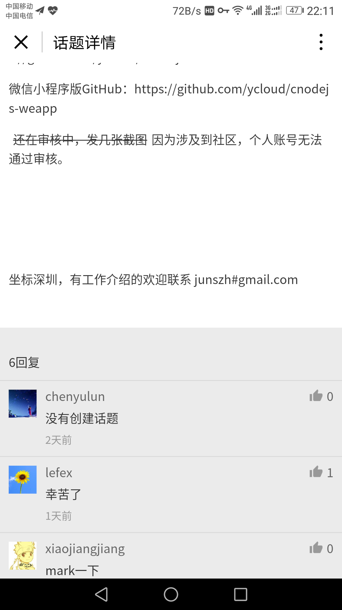
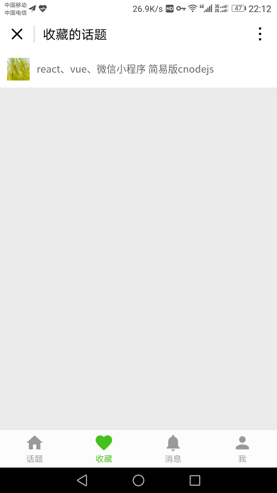
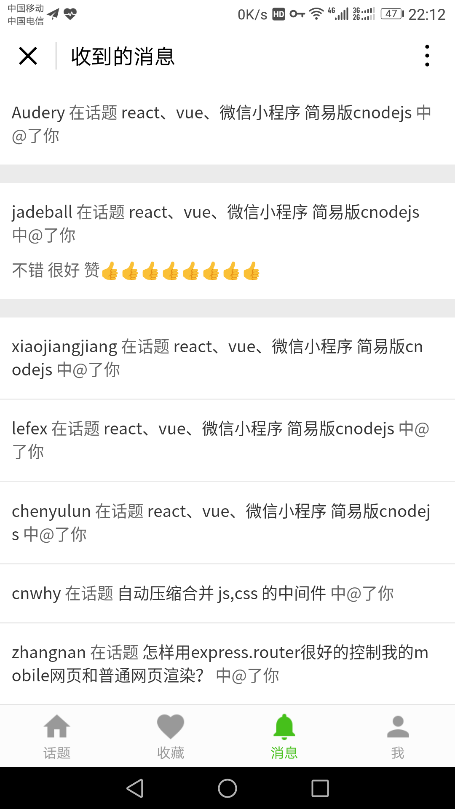
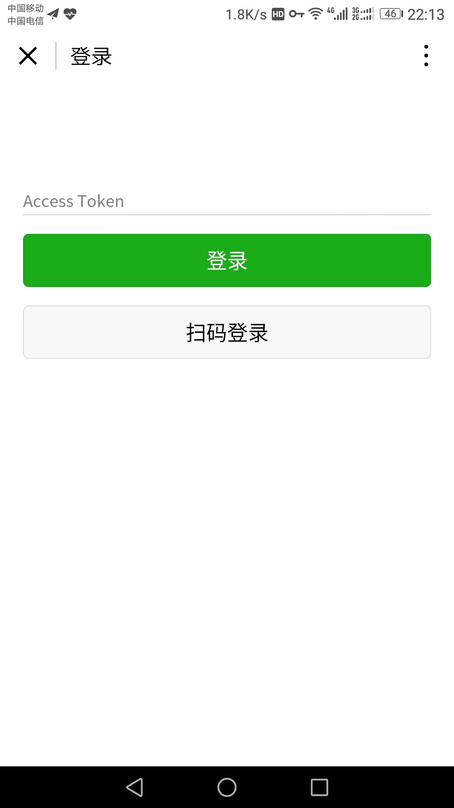

# cnodejs 微信小程序版

## 功能列表
- 话题列表 
- 话题详情
- 用户主页
- 我的主页
- 我的收藏
- 我的消息
- 登录

## 效果截图

### 话题列表

### 话题详情

### 用户主页

### 我的收藏

### 我的消息

### 登录

## 其他说明
用户登录后会把Access Token存储到localStorage中，如果用户没有主动退出则下次自动登录。
